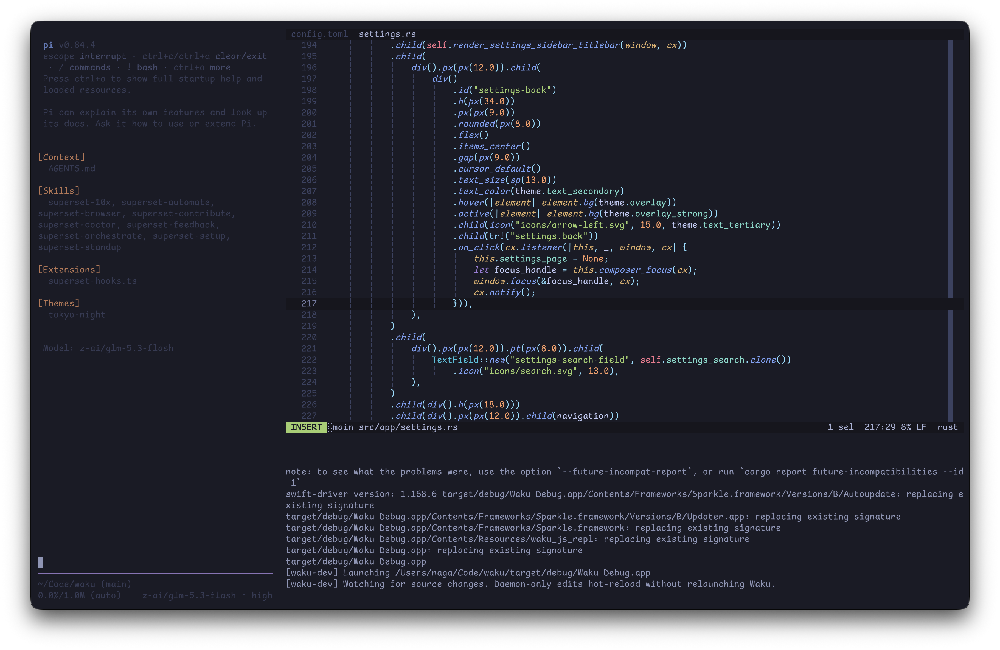

+++
title = "tiling window managers suck 🥀"
date = 2026-07-22
description = "why i stopped using tiling window managers on macOS."

[taxonomies]
tags = ["macos", "tiling window managers"]
+++

<!-- i started using tiling window managers on Linux in 2020. i loved the keyboard-first workflow and automatic layouts. -->
i spent six years trying to make every computer i used behave like [dwm](https://dwm.suckless.org). in 2026, i finally stopped.

over the years i used:

- i3
- bspwm
- dwm
- hyprland

## moving to macOS

when i got a MacBook in 2023, i wanted the same setup. i tried `yabai` + `skhd`, then [AeroSpace](https://github.com/nikitabobko/AeroSpace). AeroSpace's virtual workspaces are much faster than macOS spaces, but i eventually realized:

> tiling window managers on macOS don't really feel like tiling window managers.

## the macOS window server problem

on Linux, the window manager controls the desktop. on macOS, tools like `yabai` and AeroSpace sit on top of the system window server. They can move and resize windows, but their control is limited.

many windows should float: dialogs, settings, login prompts, and small utilities. tiling them leads to:

- windows being tiled into unconventional sizes
- dialogs getting stretched across the screen
- applications being squashed into tiny areas
- per app rules
- manual fixes for windows that should have floated

most GUI apps already have a good size. if i need to fix the layout by hand, tiling is not saving me time.

a few AeroSpace issues made this worse:

- tiny 1px windows appearing at the bottom right
- shortcut conflicts with macOS's default shortcuts
- random window glitches
- applications behaving differently depending on how they create their windows

none of these is a big problem alone. together, they made the setup feel fragile.

## rethinking my workflow

most of the time, i use one app fullscreen:

- browsing
- a cli coding agent
- an IDE to fix the shit it wrote

i don't need desktop wide tiling for this. i mainly need terminal splits.

## my new macOS workflow

i stopped trying to turn macOS into Linux. instead, i use `Hyper` + a letter to launch apps:

for example:

- `Hyper + T` → Ghostty

i configure these shortcuts with [TinyCast](https://github.com/abue-ammar/tinycast), an open source Raycast clone. this gives me what i value most: **fast app switching.** i jump directly to an app instead of managing workspaces.

- no animations.
- no workspace management.
- no window rules.
- no fighting with the macOS window server.

## tiling the terminal instead

for the terminal, i use Ghostty's built in splits. that gives me the tiling features i want without tiling the whole desktop.

i use Vim-like keybindings for navigation:

| keybind | action |
| --- | --- |
| `Ctrl + H` | go to left split |
| `Ctrl + J` | go to bottom split |
| `Ctrl + K` | go to top split |
| `Ctrl + L` | go to right split |

For creating splits:

| keybind | action |
| --- | --- |
| `Ctrl + A` then `H` | new split left |
| `Ctrl + A` then `J` | new split down |
| `Ctrl + A` then `K` | new split up |
| `Ctrl + A` then `L` | new split right |

i also have:

| keybind | action |
| --- | --- |
| `Ctrl + A` then `F` | toggle split zoom |
| `Ctrl + A` then `N` | next tab |
| `Ctrl + A` then `P` | previous tab |

And:

| keybind | action |
| --- | --- |
| `Ctrl + N` | new window |

Ghostty gives me:

- keyboard driven navigation
- splits
- fast movement between terminals
- Vim-like directional controls
- zooming into a single pane
- little need for a mouse

outside Ghostty, macOS manages the windows.

## the result

this is my least tiling focused setup since 2020, and it feels best on macOS. i do not need every window tiled, dozens of workspaces, or app specific rules. i need fast app switching and a good terminal workflow.

after years with i3, bspwm, dwm, spectrwm, Hyprland, Sway, yabai, and AeroSpace, i landed on this:

> let macOS manage GUI windows. let Ghostty manage my terminal. and use keyboard shortcuts to get everywhere quickly.
